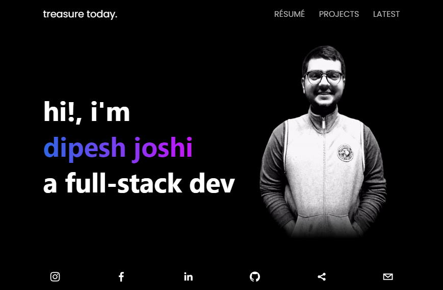

<!-- PROJECT SHIELDS -->
<!--
*** I'm using markdown "reference style" links for readability.
*** Reference links are enclosed in brackets [ ] instead of parentheses ( ).
*** See the bottom of this document for the declaration of the reference variables
*** for contributors-url, forks-url, etc. This is an optional, concise syntax you may use.
*** https://www.markdownguide.org/basic-syntax/#reference-style-links
-->

<!-- [![Contributors][contributors-shield]][contributors-url]
[![Forks][forks-shield]][forks-url]
[![Stargazers][stars-shield]][stars-url] -->
[![Issues][issues-shield]][issues-url]
[![MIT License][license-shield]][license-url]
[![LinkedIn][linkedin-shield]][linkedin-url]

<!-- PROJECT LOGO -->
<br />
<div align="center">
  <a href="https://github.com/joshidipesh12/portfolio-nextjs">
    
  </a>

<h3 align="center">Portfolio Website</h3>

  <p align="center">
    This is the repository of my portfolio website's code-base. It can used as a template for future projects.
    <br />
    <a href="https://github.com/joshidipesh12/portfolio-nextjs"><strong>Explore the docs »</strong></a>
    <br />
    <br />
    <a href="https://github.com/joshidipesh12/portfolio-nextjs">View Demo</a>
    ·
    <a href="https://github.com/joshidipesh12/portfolio-nextjs/issues">Report Bug</a>
    ·
    <a href="https://github.com/joshidipesh12/portfolio-nextjs/issues">Request Feature</a>
  </p>
</div>

<!-- TABLE OF CONTENTS -->
<details>
  <summary>Table of Contents</summary>
  <ol>
    <li>
      <a href="#about-the-project">About The Project</a>
      <ul>
        <li><a href="#built-with">Built With</a></li>
      </ul>
    </li>
    <li>
      <a href="#getting-started">Getting Started</a>
      <ul>
        <li><a href="#prerequisites">Prerequisites</a></li>
        <li><a href="#installation">Installation</a></li>
      </ul>
    </li>
    <li><a href="#usage">Usage</a></li>
    <li><a href="#roadmap">Roadmap</a></li>
    <li><a href="#contributing">Contributing</a></li>
    <li><a href="#license">License</a></li>
    <li><a href="#contact">Contact</a></li>
    <li><a href="#acknowledgments">Acknowledgments</a></li>
  </ol>
</details>

<!-- ABOUT THE PROJECT -->

## About The Project

<!-- [![My Portfolio][product-screenshot]](public/screenshot.png) -->

<p align="right">(<a href="#top">back to top</a>)</p>

### Built With

- [Next.js](https://nextjs.org/)
<!-- - [React.js](https://reactjs.org/) -->
<!-- - [Vue.js](https://vuejs.org/) -->
<!-- - [Angular](https://angular.io/) -->
<!-- - [Svelte](https://svelte.dev/) -->
<!-- - [Laravel](https://laravel.com) -->
<!-- - [Bootstrap](https://getbootstrap.com) -->
<!-- - [JQuery](https://jquery.com) -->

<p align="right">(<a href="#top">back to top</a>)</p>

<!-- GETTING STARTED -->

## Getting Started


### Prerequisites

This is an example of how to list things you need to use the software and how to install them.

- npm
  ```sh
  npm install npm@latest -g
  ```
  
  `or`

- yarn
  ```sh
  npm install --global yarn
  ```

### Installation

1. Clone the repo
   ```sh
   git clone https://github.com/joshidipesh12/portfolio-nextjs.git
   ```
2. Install NPM packages
   ```sh
    npm install && npm run dev
   ```
   
   or
   
   ```sh
    yarn install && yarn dev
   ```

_For more examples, please refer to the [NEXT.JS Documentation](https://nextjs.org/docs/getting-started)_


<p align="right">(<a href="#top">back to top</a>)</p>

<!-- 
## Roadmap

- [] Feature 1
- [] Feature 2
- [] Feature 3
  - [] Nested Feature -->

<!-- CONTRIBUTING -->

## Contributing

See the [open issues](https://github.com/joshidipesh12/portfolio-nextjs/issues) for a full list of proposed features (and known issues).

<!-- Contributions are what make the open source community such an amazing place to learn, inspire, and create. Any contributions you make are **greatly appreciated**. -->

If you have a suggestion that would make this better, please fork the repo and create a pull request. You can also simply open an issue with the tag "enhancement".
Don't forget to give the project a star! Thanks again!

1. Fork the Project
2. Create your Feature Branch (`git checkout -b feature/AmazingFeature`)
3. Commit your Changes (`git commit -m 'Add some AmazingFeature'`)
4. Push to the Branch (`git push origin feature/AmazingFeature`)
5. Open a Pull Request

<p align="right">(<a href="#top">back to top</a>)</p>

<!-- LICENSE -->

## License

Distributed under the Apache 2.0 License. See `LICENSE` for more information.

<p align="right">(<a href="#top">back to top</a>)</p>

<!-- CONTACT -->

## Contact

Dipesh Joshi - [@_joshi_dipesh_](https://instagram.com/_joshi_dipesh_) - [joshidipesh12@gmail.com](mailto:joshidipesh12@gmail.com)

Project Link: [https://github.com/joshidipesh12/joshidipesh12.github.io](https://github.com/joshidipesh12/joshidipesh12.github.io)

<p align="right">(<a href="#top">back to top</a>)</p>

<!-- ACKNOWLEDGMENTS -->

<!-- ## Acknowledgments -->

<!-- - []() -->
<!-- - []() -->
<!-- - []() -->

<!-- <p align="right">(<a href="#top">back to top</a>)</p> -->

<!-- MARKDOWN LINKS & IMAGES -->
<!-- https://www.markdownguide.org/basic-syntax/#reference-style-links -->

[contributors-shield]: https://img.shields.io/github/contributors/joshidipesh12/joshidipesh12.github.io.svg?style=for-the-badge
[contributors-url]: https://github.com/joshidipesh12/joshidipesh12.github.io/graphs/contributors
[forks-shield]: https://img.shields.io/github/forks/joshidipesh12/joshidipesh12.github.io.svg?style=for-the-badge
[forks-url]: https://github.com/joshidipesh12/joshidipesh12.github.io/network/members
[stars-shield]: https://img.shields.io/github/stars/joshidipesh12/joshidipesh12.github.io.svg?style=for-the-badge
[stars-url]: https://github.com/joshidipesh12/joshidipesh12.github.io/stargazers
[issues-shield]: https://img.shields.io/github/issues/joshidipesh12/joshidipesh12.github.io.svg?style=for-the-badge
[issues-url]: https://github.com/joshidipesh12/joshidipesh12.github.io/issues
[license-shield]: https://img.shields.io/github/license/joshidipesh12/joshidipesh12.github.io.svg?style=for-the-badge
[license-url]: https://github.com/joshidipesh12/joshidipesh12.github.io/blob/master/LICENSE.txt
[linkedin-shield]: https://img.shields.io/badge/-LinkedIn-black.svg?style=for-the-badge&logo=linkedin&colorB=555
[linkedin-url]: https://linkedin.com/in/joshidipesh12
[product-screenshot]: images/screenshot.png
